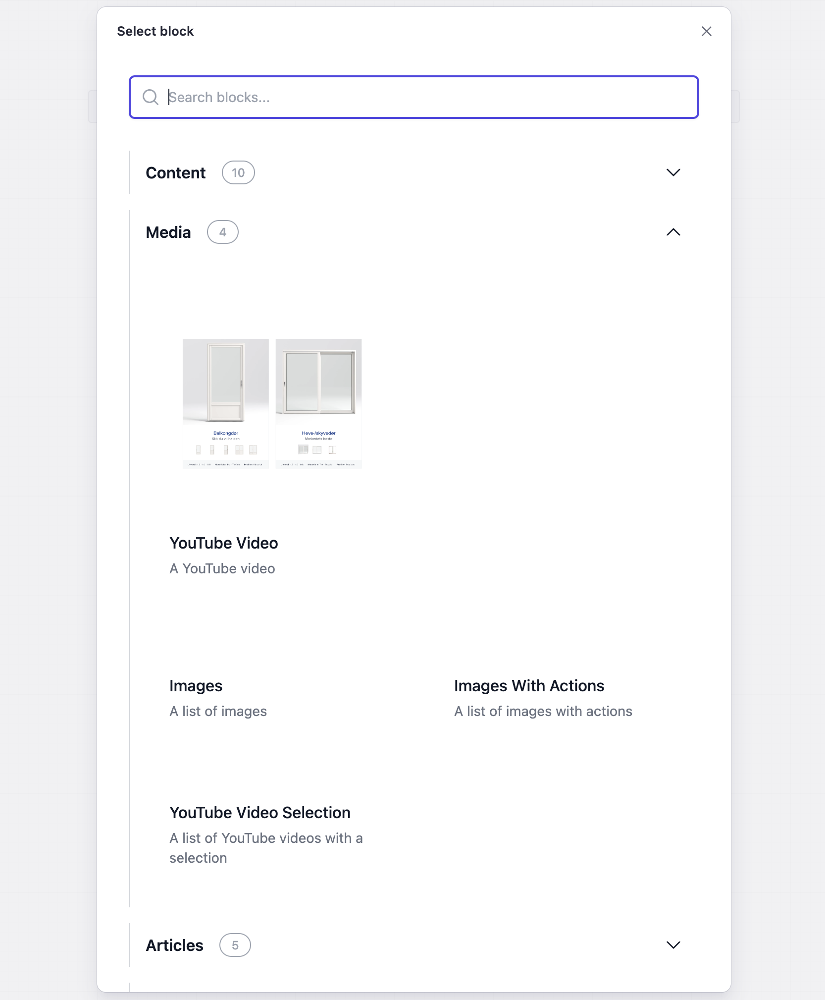
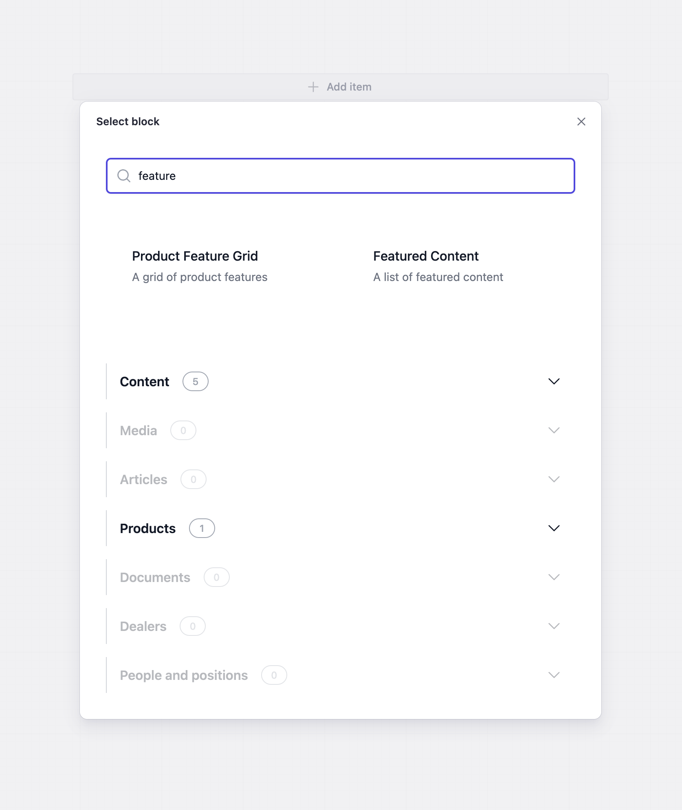

# @selvklart/sanity-block-selector


## In action





## Description

Provides components for overriding the default Sanity block selector.
Comes with two options to do this:
`WithContentArrayBlockSelector` - for the "Add Item" button at the bottom of content arrays
`WithPortableTextBlockSelector` - for the "..." buttons inside portable text editors


## Use

The components should be used as custom input components for the fields you want to have this block selector.

The `blockPreviews` field controls how the block options are rendered.
Each member of the array defines a group, which corresponds to an accordion tab.
Each group has a `title` and `blocks` it contains, where the keys of the `blocks` field correspond to the names of blocks in the `of` array.
Inside each of these, you can set a `description` and a `imageURL` to an image that represents that block (like an icon, or a preview).
Both of these fields are optional, so only the title of the block (as defined in the schema will be shown).

The `showOther` field can be set to true to create an additional group, which displays all of the blocks defined in the schema that haven't been added to `blockPreviews`.

The `excludedBlocks` field is an array of the names of the blocks you want to have hidden from the selector.

With the `text` field, you can override all of the hardcoded text values in the block selector:
- `addItem`: the text in the "Add item" button
- `dialogTitle`: the title of the dialog
- `searchPlaceholder`: the placeholder of the search input in the dialog
- `other`: the name of the `Other` tab


```ts
{
    name: 'richPortableText',
    title: 'Text',
    type: 'array',
    of: [...],
    components: {
        input: WithContentArrayBlockSelector({
            blockPreviews: [
                {
                    title: 'Content',
                    blocks: {
                        accordion: {
                            description: ''.
                            imageURL: '',
                        }
                    }
                }
            ],
            excludedBlocks: ['extendedBlock'],
            showOther: true
        })
    }
}
```


## Scripts and getting this thing running

To install dependencies:

```bash
bun install
```

To start the react-cosmos documentation:

```bash
bun start
```

To build the package:

```bash
bun run build
```

To publish the package (this will also build the package automatically):

```bash
npm publish --access public
```